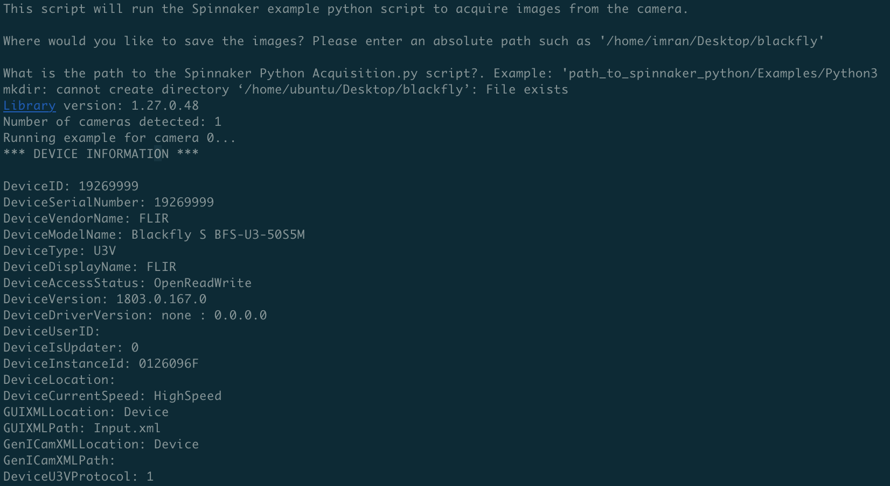
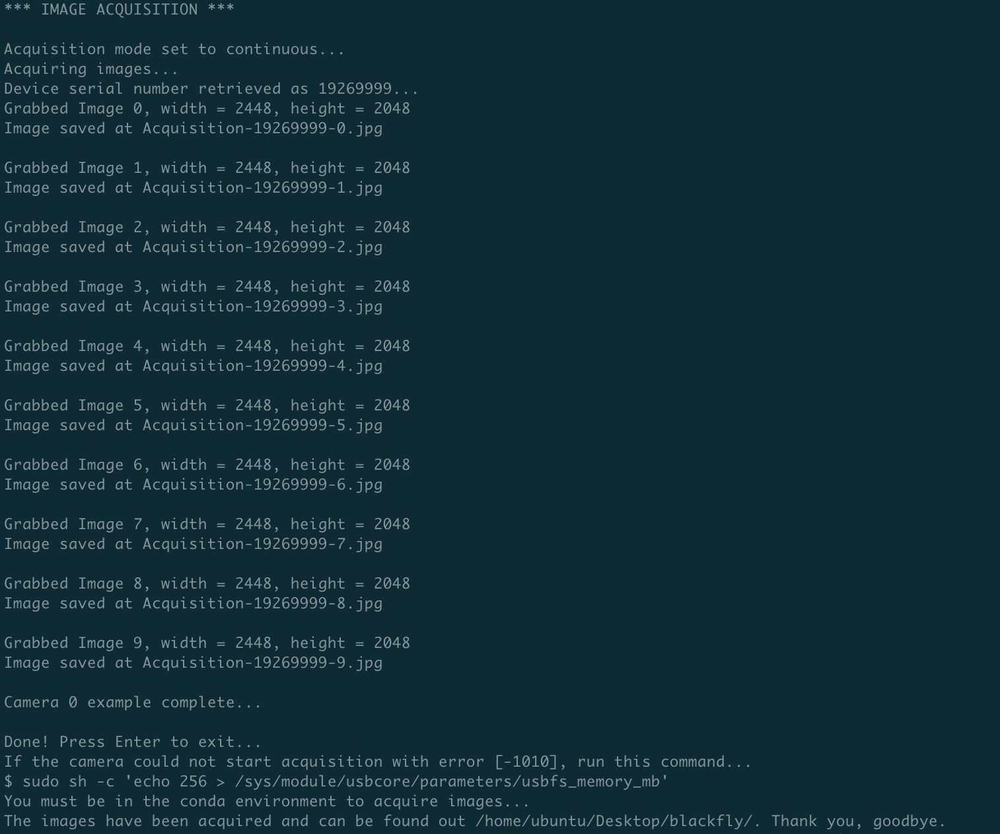

# Ubuntu Server 18.04 and Spinnaker SDK Installation on RPI4 Steps

This is a guide to installing Ubuntu Server 18.04 and Spinnaker SDK onto your RPI4. It is meant to support
image acquisition.

## Getting Started

These instructions will get you a copy of the project up and running on your local machine for development and testing purposes. See deployment for notes on how to deploy the project on a live system.

### Prerequisites

What things you need to install the software and how to install them. These downloads can be either on your local computer
and then use SCP to transfer them onto the remote computer, or can be downloaded straight onto the remote computer.

1. Download 64-bit Ubuntu Server 18.04.4 LTS from this [link](https://ubuntu.com/download/raspberry-pi/thank-you?version=18.04.4&architecture=arm64+raspi3).
2. Download the Archiconda installation script from this [link](https://github.com/Archiconda/build-tools/releases).
3. Download the Spinnaker for ARM64 package from this [link](https://flir.app.boxcn.net/v/SpinnakerSDK/file/546291925389).
4. Download the Python wrapper for Spinnaker for ARM64 package from this [link](https://flir.app.boxcn.net/v/SpinnakerSDK/file/546280393001).
5. Install BalenaEtcher from this [link](https://www.balena.io/etcher/).


### Installing Ubuntu

A step by step guide that tell you how to install Ubuntu.

1. Unzip the compressed Ubuntu Server 18.04 file.
```
unxz --keep ubuntu-18.04.4-preinstalled-server-arm64+raspi3.img.xz
```
2. Burn the .img onto the MicroSD using BalenaEtcher.
3. Insert the MicroSD into the RPI4.
4. Power on the RPI4.
5. Login using default login:
    - Username: ubuntu
    - Password: ubuntu
6. Set your new password.
7. Check SSH is running.
```
sudo systemctl status ssh
ip address
```
8. Login on your remote computer.
```
ssh -X ubuntu@[IP_ADDRESS]
```
10. Check if system is running other apt update processes.
```
ps aux | grep -i apt
```
11. Update and upgrade the system.
```
sudo apt update -y && sudo apt upgrade -y
```
12. Install Ubuntu Desktop
```
sudo apt-get install ubuntu-desktop -y
reboot
```


### Installing Spinnaker

A step by step guide that tell you how to install Spinnaker.

1. Download this repository and Archiconda installation script.
```
mkdir ~/Desktop
cd ~/Desktop
git clone https://github.com/imranmatin23/RPI4-Ubuntu18.04-Spinnaker-Installation.git
mkdir ~/Downloads
cd ~/Downloads
scp [LOCAL_PATH]/Archiconda3-0.2.3-Linux-aarch64.sh ubuntu@[IP_ADRESS]:/home/ubuntu/Downloads 
```
2. On line 2 of the Archiconda script, replace “#” with a blank line.
3. Install Archiconda and follow onscreen instructions. Exit out of SSH session when complete. Activate Archiconda.
```
sh Archiconda3-0.2.3-Linux-aarch64.sh
exit
ssh -X ubuntu@[IP_ADDRESS]
echo "conda activate" >> ~/.bashrc
. ~/.bashrc
conda activate
```
4. Create Spinnaker Python environment.
```
sh create_spinnaker_env.sh
conda activate
conda activate spinnaker_py37
```
5. Install Spinnaker and follow onscreen instructions.
```
scp [LOCAL_PATH]/spinnaker-1.27.0.48-Ubuntu18.04-arm64-pkg.tar.gz ubuntu@[IP_ADRESS]:/home/ubuntu/Downloads
scp [LOCAL_PATH]/spinnaker_python-1.27.0.48-Ubuntu18.04-cp37-cp37m-linux_aarch64.tar.gz ubuntu@[IP_ADRESS]:/home/ubuntu/Downloads
sh install_spinnaker.sh
```
6. Begin acquiring images. Confirm the camera is plugged into the black USB2.0 port.
```
sudo sh -c 'echo 256 > /sys/module/usbcore/parameters/usbfs_memory_mb'
sudo reboot
sh spinnaker_acquisition.sh < spinnaker_acquisition_inputs.sh
```




## Errors

1. If cannot SSH into SBC:
    - remove the corresponding old key from PATH/.ssh/known_hosts
2. To handle memory issue and "Error: Spinnaker: Could not Start Acquisition [-1010]" error run this command (must be done every time, can set it indefinitely by using README steps):
    - $ sudo sh -c 'echo 256 > /sys/module/usbcore/parameters/usbfs_memory_mb'
3. Don’t use sudo if not necessary

### System Notes

1. RPI4 architecture is arm64 and aarch64
2. When the camera is active it uses 3 Watts. (?CONFIRM?)

## Built With

* Ubuntu - The OS used
* Archiconda - Used to handle Python management
* Spinnaker - Used to get Spinnaker SDK
* [EasyPySpin](https://github.com/elerac/EasyPySpin) - Used to set camera settings using OpenCV

## Contributing

* None

## Versioning

* None

## Authors

* **Imran Matin** - [Github Profile](https://github.com/imranmatin23)

## License

* None

## Acknowledgments

* None

